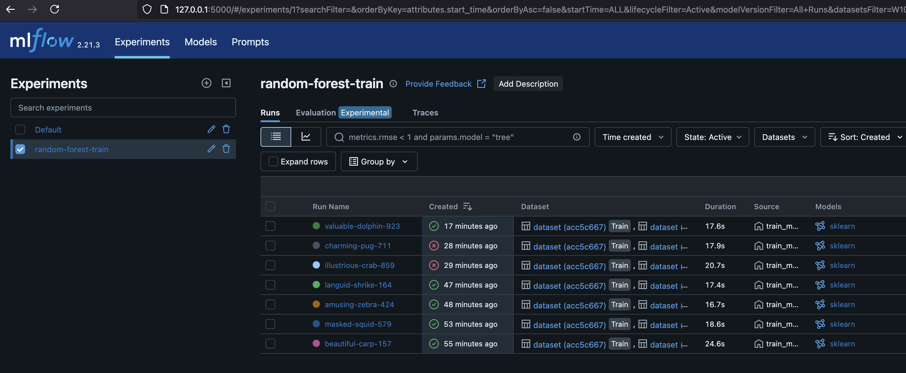
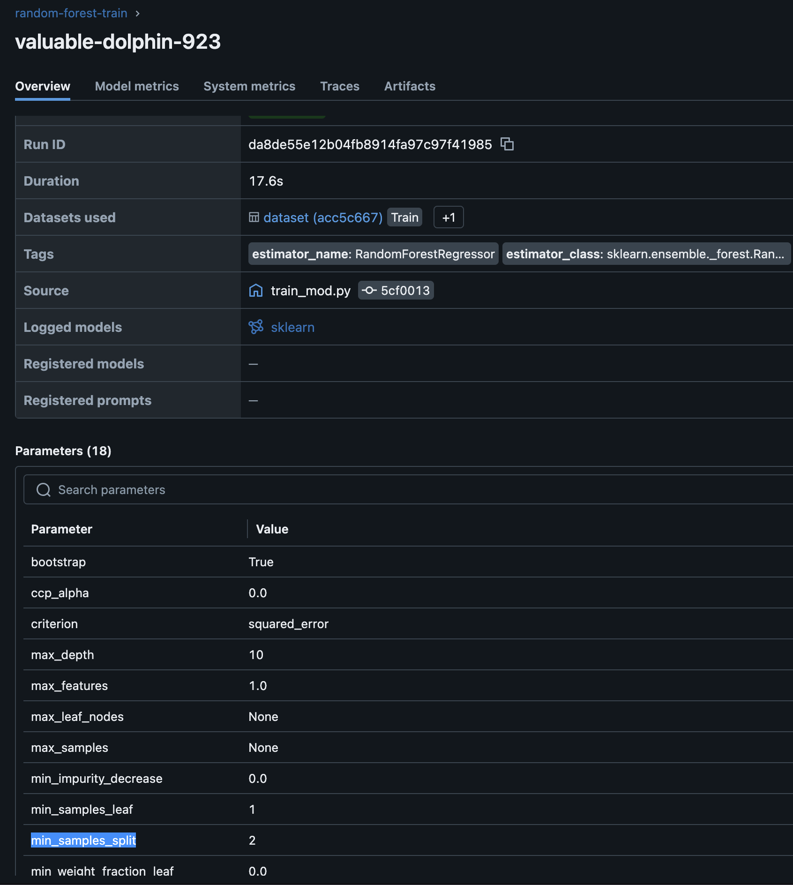

# Q1
```
conda create -n mlflow-env python=3.9 -y
conda activate mlflow-env
pip install -r requirements.txt

mlflow --version 

# Q1 Answer: 2.21.3
```

# Q2
```
mkdir -p TAXI_DATA
wget -P TAXI_DATA https://d37ci6vzurychx.cloudfront.net/trip-data/green_tripdata_2023-01.parquet # January 2023
wget -P TAXI_DATA https://d37ci6vzurychx.cloudfront.net/trip-data/green_tripdata_2023-02.parquet # February 2023
wget -P TAXI_DATA https://d37ci6vzurychx.cloudfront.net/trip-data/green_tripdata_2023-03.parquet # March 2023

python preprocess_data.py --raw_data_path ./TAXI_DATA --dest_path ./output

# Q2 Answer: 4
```
# Q3
```
python train.py

mlflow ui --backend-store-uri sqlite:///mlflow.db

# Q3 Answer: 2
```



# Q4
```
mkdir -p artifacts
mlflow server \
    --backend-store-uri sqlite:///mlflow.db \
    --default-artifact-root ./artifacts \
    --host 0.0.0.0 \
    --port 5000

# Q4 Answer: --default-artifact-root
```

# Q5

```
python hpo.py 

# Q5 Answer: 5.335
```


# Q6
```
python register_model.py

# Q6 Answer: 5.567
```
